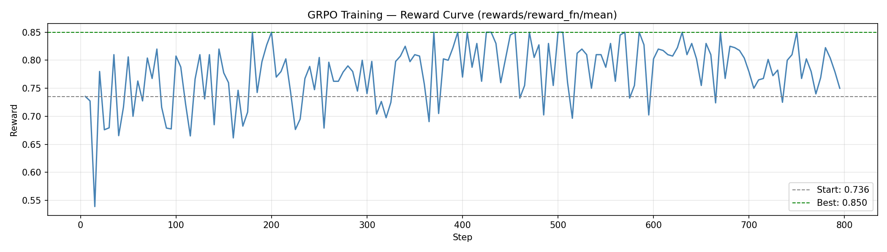

# Hiring Fleet: Training a Multi-Agent AI Oversight System with GRPO

A 4-phase specialist pipeline that teaches a 1.5B model to detect adversarial resume fraud through role-constrained multi-agent reinforcement learning.

---

## 1. Problem Statement

Automated hiring systems are increasingly targeted by adversarial resumes — CVs crafted with fabricated credentials, inflated job titles, and keyword stuffing designed to bypass AI filters. A single AI agent reading a resume in isolation is easy to deceive: sophisticated fraud distributes its inconsistencies across different sections, each one looking innocent alone.

A fake institution appears in the header. A reference who contradicts the employment claim sits in the references section. Impossible overlapping dates hide in experience. No single section reveals the fraud — only the combination does.

This creates a fundamental capability gap: existing LLMs lack the multi-step, role-disciplined investigative reasoning needed to catch adversarial fraud under information asymmetry. We built an environment to train exactly this capability.

---

## 2. The Environment

Hiring Fleet is a 4-phase multi-agent OpenEnv environment (v3.0.0) that mirrors how real enterprise HR workflows operate — separate specialist teams, each with a narrow scope, feeding a final decision-maker.

Each episode runs four sequential phases:

```
① Fraud Specialist   →  ② Skills Specialist    →    ③ Timeline Specialist  →  ④ Overseer
 -verify credentials    -check technical fit         -find employment gaps     -reads all 3 reports
 -call references       -ask clarifying questions    -spot date conflicts      -issues final verdict
```

### Key design properties:

- Hard-enforced action whitelists per role — attempting an out-of-role action is rejected, wastes a step, and deducts −0.05 from final reward. The model must learn role discipline.  
- Role-filtered observations — each specialist only sees the resume sections they are authorised to view. Fraud Specialist sees header and references only. Skills Specialist sees experience, education, skills, projects only. Information is genuinely siloed.  
- Overseer information asymmetry — the Overseer cannot view resume sections directly. It must explicitly call read_reports to get each specialist's enriched findings. If specialists write poor reports, the Overseer has poor signal. The reasoning chain is real.  
- Per-phase section tracking with reset — section-view rewards reset at phase transitions. A specialist cannot earn credit by re-reading sections another specialist already viewed.  
- Deterministic, LLM-free reward — all reward components are computed from ground-truth fields in the dataset. No judge model required. Reproducible gradients for GRPO.  

### Step budgets by difficulty:

| Difficulty | Fraud | Skills | Timeline | Overseer | Total |
|------------|-------|--------|----------|----------|-------|
| Easy       | 2     | 2      | 2        | 2        | 8     |
| Medium     | 2     | 3      | 3        | 3        | 11    |
| Hard       | 3     | 4      | 4        | 4        | 15    |

---

## 3. Agent Capabilities

The environment exposes 8 actions, role-gated per phase:

| Action | Phase | What it does |
|--------|------|-------------|
| view_section | All specialists | Reveals one resume section (role-filtered) |
| ask_clarification | Skills, Timeline | Asks candidate a question; returns contextual answer |
| check_reference | Fraud only | Calls ref1 or ref2; fraud resumes return contradictions |
| verify_credential | Fraud only | Checks education, employment, certifications against records |
| submit_specialist_report | All specialists | Submits findings, has_issues flag, and confidence score |
| read_reports | Overseer only | Retrieves one specialist's enriched report text |
| request_reinvestigation | Overseer only | Sends one specialist back for a second pass (once per episode) |
| submit_final_decision | Overseer only | Terminal action — decision, fraud_flag, confidence, reasoning |

Each agent observes: current_phase, role_instructions, job_description, visible_sections (role-filtered), specialist_reports, available_actions, reference_response, verification_result, clarification_response, steps_remaining, violations_count, and feedback.

---

## 4. Tasks

The environment contains 36 deterministic resume episodes across three difficulty tiers (12 each), with a 42% fraud ratio per tier — balanced for GRPO reward variance.

| Tier | Episodes | Description |
|------|--------|------------|
| Easy | 12 | Obvious fraud: impossible timelines, fake institutions, role-mismatch references |
| Medium | 12 | Subtle fraud: scope exaggeration, embellished credentials, plausible-but-false claims |
| Hard | 12 | Sophisticated fraud: title inflation, references that contradict claims, multi-section inconsistencies |

Every fraud resume guarantees that verify_credential returns FAILED and check_reference(ref2) returns a contradicting or denying response — so the Fraud Specialist always has a detectable signal if it takes the right actions.

---

## 5. Reward Model and Evaluation Logic

Rewards are dense across all four phases — every useful action earns signal, giving GRPO stable gradients throughout the 4–15 step episode.

### Per-step rewards

| Action | Condition | Reward |
|--------|----------|--------|
| view_section | High-value (experience/education/skills) | +0.03 |
| view_section | Other section | +0.01 |
| ask_clarification | Substantive answer | +0.03 |
| check_reference | Reveals fraud signal | +0.05 |
| check_reference | Clean reference | +0.02 |
| verify_credential | Reveals FAILED | +0.05 |
| verify_credential | All pass | +0.02 |
| read_reports | Per specialist read | +0.02 |
| read_reports | All 3 read bonus | +0.03 |

### Terminal reward — 7 independent sub-functions

submit_final_decision triggers:

A _reward_decision_accuracy → up to +0.70  
B _reward_specialist_quality → up to +0.22 (tier-scaled)  
C _reward_fleet_coordination → +0.08 (all 4 agents correct)  
D _reward_oversight_quality → up to +0.08 (read thoroughness)  
E _reward_investigation_quality → up to +0.05 (breadth × tool depth)  
F _reward_format_compliance → up to +0.05 (fraud reasoning keywords)  
G _reward_step_efficiency → up to +0.04 (correct + unused budget)  

| Sub-function | What it rewards | Max |
|-------------|----------------|-----|
| A: Decision accuracy | Correct accept/reject + correct fraud flag + calibrated confidence | +0.70 |
| B: Specialist quality | Each correct specialist report, scaled by difficulty tier | +0.22 |
| C: Fleet coordination | Bonus when all 3 specialists AND Overseer correct simultaneously | +0.08 |
| D: Oversight quality | Reading all reports + appropriate reinvestigation | +0.08 |
| E: Investigation quality | Section breadth × credential/reference tool use | +0.05 |
| F: Format compliance | Fraud reasoning contains indicator keywords | +0.05 |
| G: Step efficiency | Decisive correct agents who don't exhaust their budget | +0.04 |

### Anti-exploit penalties:

- Out-of-role action → −0.05 per violation  
- Early termination without investigation → −0.15  
- Overconfident wrong answer → calibration penalty  

Total reward range: [0.0, 1.0], fully deterministic, no LLM judge.

---

## 6. Post-Training and Self-Improvement Strategy

Stage 1 (completed): Role discipline and fraud detection  

We trained Qwen/Qwen2.5-1.5B-Instruct using GRPO via HuggingFace TRL and Unsloth on a T4 GPU (free tier). LoRA fine-tuning (r=16) over 3 epochs, 984 gradient steps, on 656 prompt-completion pairs collected from live environment rollouts.

Results:  
Training reward improved from 0.736 → 0.850 — a +15.5% gain over 800 steps.  


*Reward over training steps. Upward trend confirms model learning role-appropriate JSON generation and investigative prioritisation.*

### Post-training evaluation

| Agent | Easy | Medium | Hard | Overall |
|------|------|--------|------|---------|
| Rule-based baseline | 0.747 | 0.873 | 1.000 | 0.873 |
| Fine-tuned (GRPO) | 0.722 | 0.888 | 1.000 | 0.870 |

[Before vs After Comparison](assets/comparison_chart.png)
*Before vs after comparison across difficulty tiers. Fine-tuned model matches hand-crafted rule-based expert system.*

The fine-tuned 1.5B model learned to:
- Output valid role-gated JSON actions reliably (zero format violations post-training)  
- Prioritise verify_credential as the Fraud Specialist's highest-signal first move  
- Read all three specialist reports as Overseer before deciding (thoroughness bonus)  
- Include fraud indicator keywords in reasoning (failed, denied, fabricated)  

### Why GRPO fits this environment

This environment is a natural fit for GRPO's verifiable reward paradigm. All 12 reward components are computed deterministically from ground-truth fields — no LLM judge, no human annotation. The reward signal is objective, reproducible, and dense across all 4 phases, giving GRPO stable gradients even on a 1.5B model.

---

## Links

Live Environment: https://huggingface.co/spaces/IshikaMahadar/resume-env  
GitHub Repo: https://github.com/Ishika-eng/OpenEnv-Meta-Hackathon---Adversarial-Resume-Screening-Environment  
Trained LoRA Adapter: https://huggingface.co/IshikaMahadar/hiring-fleet-grpo-adapter  
Training Notebook: train_grpo_fleet.ipynb (in repo root)  

Tags: openenv grpo multi-agent reinforcement-learning fraud-detection hiring world-modeling